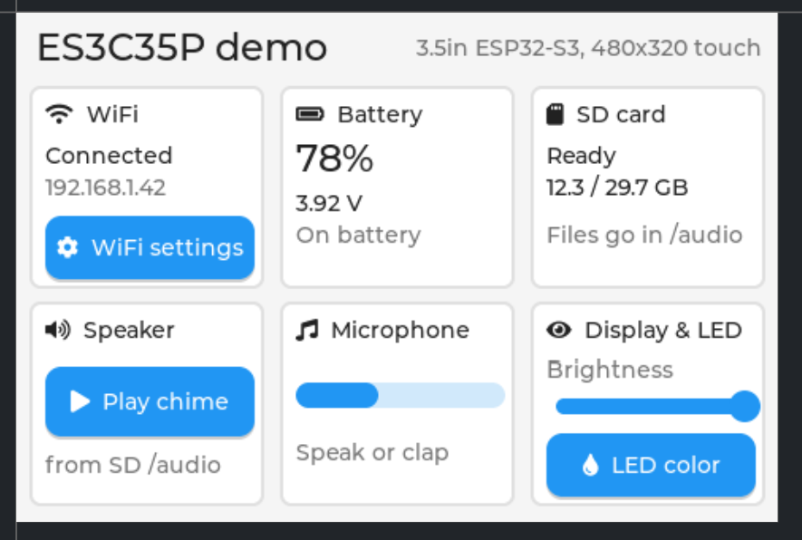

# ES3C35P EEZ Studio base: 3.5" ESP32-S3 touch display

A starting point for building [EEZ Studio](https://www.envox.eu/studio/studio-introduction/) LVGL user interfaces on the **LCDwiki ES3C35P**. This is the 3.5" ESP32-S3 all-in-one touch display, also sold under the Hosyond brand. Board page: [lcdwiki.com/3.5inch_ESP32-S3_Display](https://www.lcdwiki.com/3.5inch_ESP32-S3_Display).



The display and touch drivers work. LVGL 9.5 is wired to EEZ Studio's flow runtime. You also get WiFi screens with saved networks, and over-the-air (OTA) firmware updates. Design your screens in EEZ Studio, press **Build**, and flash.

## Hardware

| Part | Details |
|---|---|
| MCU | ESP32-S3R8, 8 MB octal PSRAM, 16 MB flash |
| Display | 3.5" IPS, 320×480 native, **Sitronix ST77922** over 4-line QSPI. Used as 480×320 landscape |
| Touch | Built into the ST77922 (TDDI), I2C address `0x55` |
| Also on board | ES8311 audio codec + speaker amp, MEMS mic, microSD, WS2812 RGB LED, Li-ion charger, battery sense |
| USB | USB-C to the S3's native USB (serial + flashing) |

Every GPIO is defined in [`include/app_config.h`](include/app_config.h). The full pin map and hardware notes are in [`board/board.md`](board/board.md).

## What works

- [x] Display: ST77922 QSPI driver with the vendor init sequence, software rotation, LVGL 9.5
- [x] Touch: ST77922 touch, mapped to the display rotation automatically
- [x] EEZ Studio flow project: native variables and native actions implemented in C++
- [x] WiFi screens: scan, connect with an on-screen keyboard, live status (IP, RSSI, MAC), 3 saved networks in flash, auto-connect at boot
- [x] OTA updates over WiFi (ArduinoOTA), with progress shown on screen
- [x] Speaker: ES8311 codec + amp, MP3/WAV from the SD card in a background task, volume with an optional ramp, built-in beep when there's no card
- [x] Microphone: ES8311 ADC on I2S1, live level meter, optional raw-sample callback for recording
- [x] microSD: mounted in the background, hot-plug detection (no card-detect pin), safe file helpers
- [x] Battery: calibrated, smoothed cell voltage
- [x] LVGL heap in PSRAM, so the UI doesn't starve WiFi of internal RAM
- [x] Backlight dimming (PWM) and the RGB LED (WS2812B)

## Getting started

### You need

- [VS Code](https://code.visualstudio.com/) with the [PlatformIO](https://platformio.org/) extension
- [EEZ Studio](https://github.com/eez-open/studio/releases) with LVGL 9.5 support, to edit the UI
- The board and a USB-C data cable

### First flash (USB)

```sh
git clone <this repo>
cd <repo>
pio run -t upload          # default env "es3c35p" uploads over USB
```

PlatformIO downloads the ESP32 platform, LVGL 9.5.0 and the audio library on the first build.

> **Windows: keep the project path short.** LVGL's include paths are long, and if the project sits in a deep folder the compiler passes Windows' 260-character path limit. The build then fails with an error like `fatal error: ../lv_conf_internal.h: No such file or directory`, even though the file exists. Clone to something like `C:\dev\es3c35p`, or [enable long paths](https://learn.microsoft.com/windows/win32/fileio/maximum-file-path-limitation#enable-long-paths-in-windows-10-version-1607-and-later) in Windows. After flashing you'll see the Main screen. Tap **WiFi** to set up a network.

### The Main screen: a dashboard of the board's features


| Card | Shows / does |
|---|---|
| **WiFi** | Connection status and IP. **WiFi settings** opens the scan / connect / saved-networks screens |
| **Battery** | Cell voltage (the board only wires the voltage to the ESP32) |
| **SD card** | "Ready", "No card" or "No chime.wav", and free / total space |
| **Speaker** | **Play chime** plays `/audio/chime.wav` from the card (tap again to stop; the built-in beep plays if it's missing) |
| **Microphone** | Live level bar: speak or clap near the board |
| **Display & LED** | Brightness slider (backlight PWM) and **LED color**, which cycles the RGB LED |

For the Speaker card, copy the contents of this repo's [`sd_card/`](sd_card) folder to the root of a FAT32 microSD card, so the card has `/audio/chime.wav`. You can insert it while the board is running.

`tools/make_test_sound.py` regenerates `chime.wav`.

### Updating over WiFi (OTA)

OTA is on at boot by default. On the WiFi screen, the OTA row says **Ready** once the board is connected.

```sh
pio run -e ota -t upload   # uploads to esp32-display.local
```

> **Change the OTA password before you use this on a real network.** It is `esp32ota` by default and must match in two places: `OTA_PASSWORD` in `include/app_config.h` and `--auth` in `platformio.ini`. The same goes for the host name and port. If `esp32-display.local` doesn't resolve (common on Windows), set `upload_port` in `platformio.ini` to the IP shown on the WiFi screen.

## Editing the UI in EEZ Studio

1. Open **`ES3C35P.eez-project`** in EEZ Studio. The screen size is set to 480×320.
2. Design pages, widgets, styles and flow.
3. Press **Build (Ctrl+B)**. EEZ Studio writes the C code into `src/ui/`.
4. Flash with `pio run -t upload`.

**Never edit `src/ui/` by hand.** EEZ Studio regenerates it on every build. Put your own code in `src/drivers/`, `src/managers/` or `src/gui/`.

How the C++ side connects to the EEZ project (see [`src/gui/wifi_screens.cpp`](src/gui/wifi_screens.cpp) for a complete example):

- **Native variables** (`"native": true` in EEZ): implement `get_var_<name>()` / `set_var_<name>()`. Labels bound to them update automatically.
- **Native actions** (implementation type *native*): implement `void action_<name>(lv_event_t *e)`. Use the event handler's *user data* to tell buttons apart.
- **Changing screens from C**: `eez_flow_set_screen(id, LV_SCR_LOAD_ANIM_NONE, 0, 0)`. Ids are 1-based in page order (Main=1, Wifi=2, WifiSaved=3).
- **Show/hide from state**: bind a widget's *Hidden* flag to an expression (e.g. `wifi_connected` / `!wifi_connected`).
- **From C, change only content, state and flags** on `objects.<widget>`, never position or size. Otherwise the device won't match what EEZ Studio shows.

## Configuration

Everything you're likely to change lives in [`include/app_config.h`](include/app_config.h):

| Setting | Default | What it does |
|---|---|---|
| `LCD_ROTATION` | `3` | 480×320 landscape. Use `1` for the other landscape, `0`/`2` for portrait (the EEZ project size must match) |
| `LCD_MADCTL` | `0x00` | Mirror / red-blue swap bits, if your panel needs them |
| `LCD_SPI_HZ` | `80000000` | QSPI clock. Lower it if you see corruption |
| `WIFI_HOSTNAME` | `esp32-display` | DHCP / mDNS / OTA host name |
| `WIFI_AUTOCONNECT_AT_BOOT` | `1` | Try saved networks at boot |
| `WIFI_CONNECT_TIMEOUT_MS`, `WIFI_SCAN_TIMEOUT_MS` | `15000` | WiFi timeouts |
| `OTA_ENABLED_DEFAULT` | `1` | OTA switch state at boot |
| `OTA_PORT`, `OTA_PASSWORD` | `3232`, `esp32ota` | Must match `[env:ota]` in `platformio.ini` |
| `AUDIO_DEFAULT_VOLUME_PCT`, `AUDIO_MAX_DB` | `70`, `6` | Default play volume; codec gain at 100 % (higher = louder, may distort) |
| `AUDIO_TEST_SOUND` | `chime.wav` | File in `/audio` played by the Main screen button |
| `MIC_PGA_DB`, `MIC_METER_FLOOR_DBFS` | `24`, `-70` | Mic preamp gain; level shown as an empty meter |
| `BACKLIGHT_DEFAULT_PCT`, `BACKLIGHT_MIN_PCT` | `100`, `5` | Brightness at boot; lowest the slider allows |
| `RGB_LED_LEVEL` | `40` | RGB LED channel brightness, 0-255 |
| `SD_FREQ_KHZ`, `SD_FOLDERS` | `20000`, `{"/audio"}` | SD clock; folders created on every mount |
| `BAT_CAL_OFFSET_V` | `0.02` | ADC calibration offset (V) |

LVGL is configured with build flags in [`platformio.ini`](platformio.ini) (there is no `lv_conf.h`). For example, add `-DLV_FONT_MONTSERRAT_20=1` to enable another built-in font size.

## Project layout

```
ES3C35P.eez-project     EEZ Studio project (the UI source of truth)
platformio.ini          Build envs: es3c35p (USB, default) and ota (WiFi)
include/app_config.h    Pins + every user-tunable setting
src/
  main.cpp              Startup and main loop (shows the init order)
  drivers/              Hardware + LVGL port (plain functions)
    lcd_st77922.*         ST77922 QSPI display (vendor init sequence)
    touch_st77922.*       ST77922 touch (I2C 0x55)
    lvgl_port.*           LVGL display/touch glue (rotation, 4-px alignment)
    lvgl_mem_psram.cpp    LVGL heap in PSRAM
    es8311.*              ES8311 audio codec (playback + mic)
    backlight.*           Backlight brightness (PWM)
    rgb_led.*             RGB LED (WS2812B)
  managers/             Features, each a singleton with begin()/loop()
    storage_manager.*     microSD mount task + file helpers
    audio_manager.*       Sound playback from SD (MP3/WAV), amp + volume
    mic_manager.*         Mic on I2S1, level meter, sample callback
    battery_manager.*     Battery voltage
    wifi_manager.*        Scan / connect / saved networks
    ota_manager.*         ArduinoOTA on/off and status
  gui/                  EEZ glue: native actions + variables, one file per screen
    main_screen.*         Main screen dashboard (one card per feature)
    wifi_screens.*        Wifi + WifiSaved screens
  ui/                   GENERATED by EEZ Studio. Do not edit
sd_card/                Copy to the SD card root (test sound in /audio)
tools/                  make_test_sound.py (regenerates the test sound)
board/board.md          Pin map, hardware notes, and every quirk found so far
docs/                   Screenshots for this README
AGENTS.md, .claude/     Rules and an EEZ Studio skill for AI coding agents
```

## Board quirks worth knowing

These took time to find. Details are in [`board/board.md`](board/board.md).

- The ST77922 needs the vendor's long init sequence, and commands must be framed **exactly** like the vendor driver does. Otherwise the screen stays black after a hard reset.
- Pixel writes use `0x32` + RAMWRC (`0x3C`). The windows must be 4-pixel aligned. The panel can't swap axes, so landscape is done by LVGL in software.
- The LCD reset is tied to the chip reset. A USB soft reset doesn't reset the panel, so use the **RESET button** when testing display init.
- A WiFi scan takes about 6.4 s, longer than the Arduino core's 6 s async timeout. The WiFi manager handles this.
- The I2S data nets are named from the codec's side: ESP32 audio **out is GPIO15**, mic **in is GPIO16**. The amp enable is active LOW.
- The mic can't share I2S0 with playback (duplex broke both). It runs on I2S1 as a slave on playback's clock, so start audio first.

## Using AI coding agents

[`AGENTS.md`](AGENTS.md) holds the project rules (never edit `src/ui/`, settings go in `app_config.h`, and so on). [`.claude/skills/eezstudio/`](.claude/skills/eezstudio/SKILL.md) is a skill for editing the `.eez-project` JSON safely. Its *READ FIRST* section is adapted to this project.

## Credits

- Panel init sequence and touch protocol: from LCDwiki's vendor examples ([mirror](https://github.com/ydedox/st77922)).
- Audio, mic, SD and battery code: ported from the author's Alarm Clock project for this board. Also helpful: [espressif/arduino-esp32#12694](https://github.com/espressif/arduino-esp32/issues/12694)
- [LVGL](https://lvgl.io/), [EEZ Studio](https://github.com/eez-open/studio), [Arduino-ESP32](https://github.com/espressif/arduino-esp32), [ESP32-audioI2S](https://github.com/esphome/ESP32-audioI2S), [PlatformIO](https://platformio.org/)

The schematic and datasheets are not included because they're vendor documents. [`board/board.md`](board/board.md) links to them.

## License

[MIT](LICENSE)
